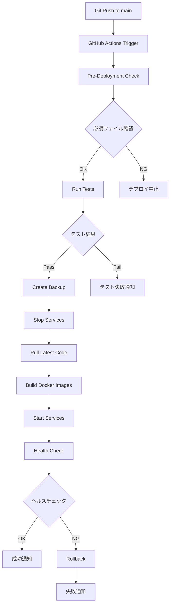

# 自動デプロイ設定ガイド

Mac MiniでのGitHub Actions自動デプロイシステムの設定方法とトラブルシューティング

## 目次

1. [概要](#概要)
2. [前提条件](#前提条件)
3. [セットアップ手順](#セットアップ手順)
4. [動作フロー](#動作フロー)
5. [利用可能なスクリプト](#利用可能なスクリプト)
6. [トラブルシューティング](#トラブルシューティング)
7. [よくある質問](#よくある質問)

---

## 概要

このプロジェクトでは、**GitHub Actions**と**self-hosted runner**を使用して、Mac Mini上で自動デプロイシステムを実装しています。

### 主な機能

- ✅ main/masterブランチへのpush時に自動デプロイ
- ✅ テスト自動実行（Backend + Frontend）
- ✅ コード品質チェック（Lint + Type Check）
- ✅ Docker イメージの自動ビルド
- ✅ ヘルスチェックによる検証
- ✅ デプロイ失敗時の自動ロールバック
- ✅ デプロイ状態の通知

### アーキテクチャ

```
GitHub リポジトリ
    ↓ (push)
GitHub Actions
    ↓ (trigger)
Mac Mini (self-hosted runner)
    ↓
1. Pre-Deployment Check
    ↓
2. Run Tests
    ↓
3. Deploy to Mac Mini
    ↓
4. Health Check
    ↓ (on success)
5. Notify Success
    ↓ (on failure)
6. Rollback
```

---

## 前提条件

### 必要な環境

- **Mac Mini** (macOS 12.0以上推奨)
- **Docker Desktop for Mac** (20.0以上)
- **Docker Compose** (2.0以上)
- **Git**
- **GitHub アカウント** (リポジトリへの管理者権限)

### 必要な権限

- GitHubリポジトリへの**admin**権限または**write**権限
- GitHub Personal Access Token（repo権限）

---

## セットアップ手順

### ステップ 1: GitHub Personal Access Token の取得

1. GitHubにログイン
2. Settings → Developer settings → Personal access tokens → Tokens (classic)
3. "Generate new token" をクリック
4. スコープで **`repo`** を選択
5. トークンを生成してコピー（後で使用）

### ステップ 2: Self-Hosted Runner のセットアップ

Mac Miniで以下のコマンドを実行：

```bash
# プロジェクトディレクトリに移動
cd /path/to/csi-web-platform

# 環境変数を設定
export GITHUB_TOKEN='your-token-here'

# セットアップスクリプトを実行
./scripts/setup-runner.sh
```

セットアップスクリプトが以下を自動で行います：

- GitHub Actions Runnerのダウンロードとインストール
- Runnerの登録と設定
- macOSサービスとしての登録（オプション）

### ステップ 3: GitHub環境の設定

1. GitHubリポジトリ → **Settings** → **Environments**
2. "New environment" をクリック
3. 環境名を **`production`** に設定
4. （オプション）Protection rulesを設定：
   - Required reviewers（レビュー必須）
   - Wait timer（デプロイ前の待機時間）

### ステップ 4: 動作確認

1. 軽微な変更をmainブランチにpush
2. GitHub リポジトリ → **Actions** タブで進行状況を確認
3. デプロイが成功したら以下にアクセス：
   - Frontend: http://localhost:3000
   - Backend API: http://localhost:8000/docs

---

## 動作フロー

### 自動デプロイフロー



### ジョブの詳細

#### 1. Pre-Deployment Check
- 必須ファイルの存在確認
- デプロイ準備状態のチェック

#### 2. Run Tests
- バックエンドテスト実行（pytest）
- フロントエンドテスト実行（npm test）
- コード品質チェック（black, flake8, eslint）
- TypeScript型チェック
- ZKP回路の確認

#### 3. Deploy to Self-Hosted Server
- データベースバックアップ
- 既存サービス停止
- 最新コードのpull
- Dockerイメージビルド
- サービス起動

#### 4. Health Check
- Backend API ヘルスチェック (http://localhost:8000/health)
- Frontend ヘルスチェック (http://localhost:3000)

#### 5. Rollback on Failure
- デプロイ失敗時の自動ロールバック
- 最新バックアップからのリストア
- サービスの再起動

---

## 利用可能なスクリプト

### `scripts/setup-runner.sh`
**説明**: Self-hosted runnerの初期セットアップ

```bash
export GITHUB_TOKEN='your-token'
./scripts/setup-runner.sh
```

### `scripts/deploy.sh`
**説明**: 手動デプロイスクリプト（既存）

```bash
./scripts/deploy.sh
```

### `scripts/backup.sh`
**説明**: データベースとRedisのバックアップ

```bash
./scripts/backup.sh
```

### `scripts/rollback.sh`
**説明**: 前のバージョンへのロールバック

```bash
./scripts/rollback.sh
```

### `scripts/health-check.sh`
**説明**: システムヘルスチェック

```bash
./scripts/health-check.sh
```

---

## トラブルシューティング

### Q: Runnerが起動しない

**解決方法**:

```bash
# Runnerの状態確認
cd ~/actions-runner
sudo ./svc.sh status

# Runnerの再起動
sudo ./svc.sh stop
sudo ./svc.sh start

# ログ確認
tail -f ~/actions-runner/_diag/*.log
```

### Q: デプロイが失敗する

**確認ポイント**:

1. **ログ確認**:
   ```bash
   docker-compose logs backend
   docker-compose logs frontend
   ```

2. **ポート競合確認**:
   ```bash
   lsof -i :3000
   lsof -i :8000
   ```

3. **Docker状態確認**:
   ```bash
   docker-compose ps
   docker-compose down
   docker-compose up -d
   ```

### Q: ヘルスチェックがタイムアウトする

**解決方法**:

```bash
# サービス起動待機時間を延長
# .github/workflows/deploy.yml の sleep 30 を sleep 60 に変更

# 手動でヘルスチェック実行
./scripts/health-check.sh
```

### Q: Gitのpullができない

**解決方法**:

```bash
# SSH鍵の確認
ssh -T git@github.com

# HTTPSの場合、認証情報の確認
git config --get credential.helper

# 必要に応じてSSH鍵を設定
ssh-keygen -t ed25519 -C "your_email@example.com"
cat ~/.ssh/id_ed25519.pub
# → GitHubのSettings → SSH keysに登録
```

### Q: Docker buildが遅い

**解決方法**:

```bash
# Buildキャッシュのクリア
docker builder prune -a

# BuildKitを有効化（高速化）
export DOCKER_BUILDKIT=1

# 不要なイメージ削除
docker image prune -a
```

---

## よくある質問

### Q: 手動でデプロイを実行できますか？

**A**: はい、GitHub Actionsの "Actions" タブから手動実行可能です。

1. GitHub リポジトリ → Actions → "Auto Deploy to Production"
2. "Run workflow" をクリック
3. 環境を選択（production/staging）
4. "Run workflow" を実行

### Q: 特定のブランチのみデプロイしたい場合は？

**A**: `.github/workflows/deploy.yml` の以下の部分を編集：

```yaml
on:
  push:
    branches:
      - main        # このブランチのみ有効
      - develop     # 追加したいブランチ
```

### Q: デプロイ通知をSlackやメールで受け取りたい

**A**: Notifyジョブを拡張してSlack通知を追加できます：

```yaml
- name: Notify Slack
  uses: slackapi/slack-github-action@v1
  with:
    webhook-url: ${{ secrets.SLACK_WEBHOOK_URL }}
    payload: |
      {
        "text": "Deployment completed: ${{ job.status }}"
      }
```

### Q: Runnerの停止・削除方法は？

**A**: 以下のコマンドで停止・削除できます：

```bash
# サービス停止
cd ~/actions-runner
sudo ./svc.sh stop
sudo ./svc.sh uninstall

# Runner削除
./config.sh remove --token YOUR_REMOVAL_TOKEN

# ディレクトリ削除
rm -rf ~/actions-runner
```

---

## セキュリティのベストプラクティス

### Secrets管理

GitHub Secretsを使用して機密情報を管理：

1. リポジトリ → Settings → Secrets and variables → Actions
2. "New repository secret" で以下を追加：
   - `DATABASE_PASSWORD`
   - `JWT_SECRET_KEY`
   - `REDIS_PASSWORD`（必要に応じて）

### 環境変数の使用

ワークフローで環境変数を参照：

```yaml
- name: Deploy
  env:
    DB_PASSWORD: ${{ secrets.DATABASE_PASSWORD }}
    JWT_SECRET: ${{ secrets.JWT_SECRET_KEY }}
  run: |
    echo "DB_PASSWORD=$DB_PASSWORD" >> backend/.env
```

---

## パフォーマンス最適化

### キャッシュの活用

依存関係のキャッシュで高速化：

```yaml
- name: Cache Python dependencies
  uses: actions/cache@v3
  with:
    path: ~/.cache/pip
    key: ${{ runner.os }}-pip-${{ hashFiles('**/requirements.txt') }}
```

### 並列実行

独立したジョブを並列実行：

```yaml
jobs:
  test-backend:
    runs-on: self-hosted
    # ...

  test-frontend:
    runs-on: self-hosted
    # ...
```

---

## 追加リソース

- [GitHub Actions公式ドキュメント](https://docs.github.com/en/actions)
- [Self-hosted runners](https://docs.github.com/en/actions/hosting-your-own-runners)
- [Docker Compose リファレンス](https://docs.docker.com/compose/)

---

## サポート

問題が発生した場合：

1. **ログ確認**: GitHub Actions の詳細ログを確認
2. **Issue作成**: GitHubリポジトリでIssueを作成
3. **ドキュメント参照**: プロジェクトの他のドキュメントを確認

---

**最終更新**: 2026-01-14
**バージョン**: 1.0.0
