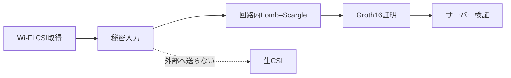
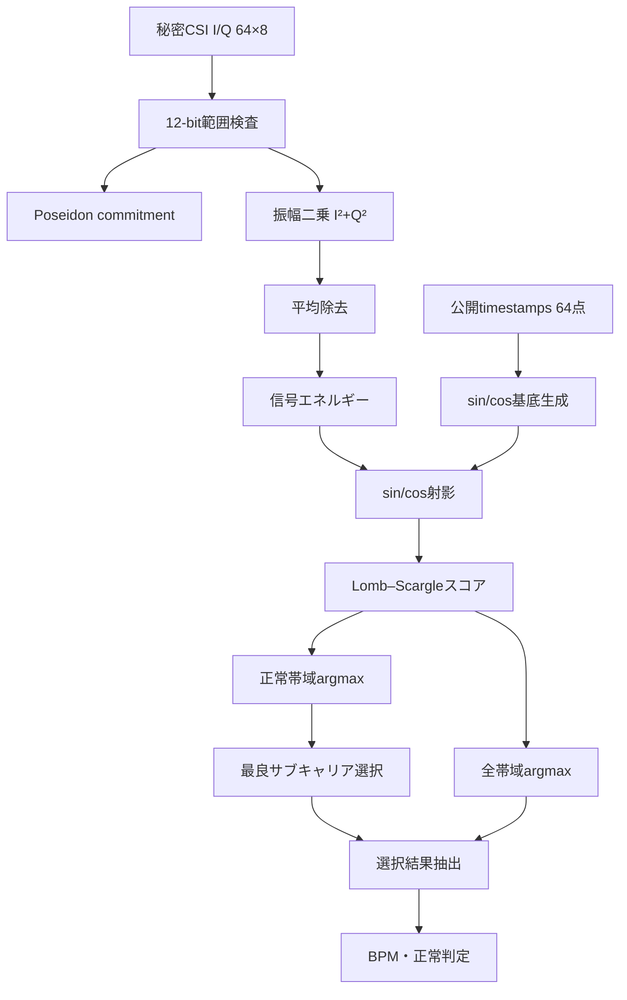
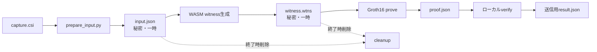

# Lomb–Scargle完全回路化 進捗報告スライド構成案

対象: 研究室・プロジェクト進捗報告  
想定発表時間: 10～15分  
推奨枚数: 13～15枚

この資料は、そのままスライドへ転記できる文章、図、コード、発表時の補足をまとめたもの。
各スライドでは文章を詰め込みすぎず、太字部分と図を中心に見せる。

---

## スライド1: タイトル

### タイトル案

> Wi-Fi CSI呼吸推定の完全ZK回路化とエッジ実行環境の構築

### サブタイトル案

> 生CSIを公開せず、端末内でLomb–Scargle推定とGroth16証明を完結

### 載せる情報

- 発表者名
- 所属
- 発表日
- プロジェクト名

### 一番下に置く短いメッセージ

> 生CSI I/Qから呼吸数・正常判定までを回路内で拘束し、エッジ配布可能な証明パッケージを作成した。

### 発表時に話すこと

- 今回はアルゴリズム精度の最終評価ではなく、完全回路化とエッジ証明生成の実現可能性を報告する。
- 現行方式との違いと未確認事項も後半で説明する。

---

## スライド2: 研究の背景と理想像

### 見出し

> なぜ「エッジ上の完全回路化」が必要か

### 左側: 現状の課題

- Wi-Fi CSIには人の微細な動きや呼吸情報が含まれる。
- 生CSIをサーバーへ送る構成では、保存・通信・運用者からの漏洩リスクが残る。
- 後段の正常判定だけをZKP化しても、回路外の前処理結果を捏造できる余地がある。

### 右側: 目標

```text
エッジデバイス
  ├─ CSI取得
  ├─ 呼吸推定
  ├─ ZK証明生成
  └─ 生CSI・witnessを破棄
          ↓
サーバーへ送信
  ├─ Groth16 proof
  ├─ CSI commitment
  ├─ 推定BPM
  └─ 正常判定
```

### 強調する一文

> サーバーはCSIを見ずに「所定の計算結果であること」だけを検証する。

### 図にする場合



### 発表時に話すこと

- 「暗号化して送る」のではなく、「そもそも生CSIを送らない」構成を目指している。
- ZKPはデータを隠すだけでなく、計算の整合性も検証するために使う。

---

## スライド3: これまでの方式と今回の変更

### 見出し

> PCA後の波形を証明する方式から、生CSI入力の回路へ

### 比較表

| 項目 | 従来Lomb–Scargle回路 | 今回の回路 |
|---|---|---|
| 秘密入力 | PCA後の3波形 | 生CSI I/Q |
| 前処理 | Python | 振幅二乗・平均除去を回路内実行 |
| サブキャリア処理 | Pythonで選択・PCA | 回路内で8本を比較 |
| Lomb–Scargle | 回路内 | 回路内 |
| CSIコミットメント | なし | Poseidonで生成 |
| エッジ配布物 | 未整備 | WASM・zkey・ランナーを同梱 |

### 注意書き

> 今回は現行PythonのSNR選択・Butterworth・PCAをそのまま移植したのではなく、回路親和的な直接Lomb–Scargle方式へ再設計した。

### 発表時に話すこと

- 「完全回路化」は固定形式64×8のCSI入力以降を指す。
- PicoScenesバイナリ解析と64×8への標本化・量子化は回路外に残る。

---

## スライド4: 回路全体の処理フロー

### 見出し

> 回路内で実行する16段階

### スライドに載せる図



### 右下に載せる固定パラメータ

```text
samples       : 64
subcarriers   : 8
frequency bins: 32
I/Q           : 12-bit
normal bins   : 5..27
```

### 発表時に話すこと

- CSI波形、スペクトル、射影値はすべて秘密のまま。
- 公開されるのはコミットメント、bin、BPM、正常判定、証明。

---

## スライド5: 秘密入力と公開情報

### 見出し

> 何を隠し、何を検証者へ見せるか

### 秘密入力

- `csiI[64][8]`
- `csiQ[64][8]`
- `commitmentNonce`

### 公開入力

- `timestampsMs[64]`

### 公開出力

- `csiCommitment`
- `selectedSubcarrier`
- `estimatedFrequencyBin`
- `globalPeakFrequencyBin`
- `isNormal`

### コードスクショ候補1

ファイル:

```text
zkp/circuits/csi_lomb_scargle_end_to_end.circom
44～53行目
```

スライドへ載せるコード:

```circom
signal input csiI[SAMPLE_COUNT][SUBCARRIERS];
signal input csiQ[SAMPLE_COUNT][SUBCARRIERS];
signal input commitmentNonce;
signal input timestampsMs[SAMPLE_COUNT];

signal output csiCommitment;
signal output isNormal;
signal output selectedSubcarrier;
signal output estimatedFrequencyBin;
signal output globalPeakFrequencyBin;
```

### スクショで強調する場所

- `csiI`、`csiQ`、`commitmentNonce`を青枠
- 公開出力5つを緑枠
- `main {public [timestampsMs]}` も別途小さく表示

### 発表時に話すこと

- Circomでは `main` のpublic指定以外の入力は秘密witnessになる。
- 出力は公開されるが、CSI値やスペクトルそのものは含まない。

---

## スライド6: CSIコミットメント

### 見出し

> 秘密CSI全体をPoseidonハッシュへ拘束

### 説明

全I/Q値を固定順序でハッシュチェーンへ入力する。

```text
state₀ = nonce
state₁ = Poseidon(state₀, I[0][0], Q[0][0])
state₂ = Poseidon(state₁, I[0][1], Q[0][1])
...
state₅₁₂ = CSI commitment
```

### コードスクショ候補2

ファイル:

```text
zkp/circuits/csi_lomb_scargle_end_to_end.circom
80～100行目
```

```circom
commitmentState[0] <== commitmentNonce;
for (var i = 0; i < SAMPLE_COUNT; i++) {
    for (var sc = 0; sc < SUBCARRIERS; sc++) {
        var position = i * SUBCARRIERS + sc;
        commitmentStep[position] = Poseidon(3);
        commitmentStep[position].inputs[0] <== commitmentState[position];
        commitmentStep[position].inputs[1] <== csiI[i][sc];
        commitmentStep[position].inputs[2] <== csiQ[i][sc];
        commitmentState[position + 1] <== commitmentStep[position].out;
    }
}
csiCommitment <== commitmentState[SAMPLE_COUNT * SUBCARRIERS];
```

### 発表時に話すこと

- CSIを1値変更するとコミットメントも変わる。
- nonceを秘密にすることで小規模な候補入力への辞書攻撃を難しくする。
- 今後はエッジデバイス署名をコミットメントへ付け、取得端末との真正性を保証したい。

---

## スライド7: 振幅化と平均除去

### 見出し

> 平方根と除算を避けた回路親和的な前処理

### 振幅二乗

通常の振幅:

```text
|CSI| = sqrt(I² + Q²)
```

今回:

```text
m = I² + Q²
```

### 平均除去

通常:

```text
mᵢ - Σm/N
```

今回:

```text
yᵢ = N×mᵢ - Σm
   = N×(mᵢ - mean(m))
```

### コードスクショ候補3

ファイル:

```text
zkp/circuits/csi_lomb_scargle_end_to_end.circom
116～137行目
```

```circom
signedI[i][sc] <== csiI[i][sc] - CSI_OFFSET;
signedQ[i][sc] <== csiQ[i][sc] - CSI_OFFSET;
iSquared[i][sc] <== signedI[i][sc] * signedI[i][sc];
qSquared[i][sc] <== signedQ[i][sc] * signedQ[i][sc];
magnitudeSquared[i][sc] <== iSquared[i][sc] + qSquared[i][sc];

centered[i][sc] <==
    SAMPLE_COUNT * magnitudeSquared[i][sc] - magnitudeSum[sc];
```

### 発表時に話すこと

- ZK回路では平方根、浮動小数点、除算が高コスト。
- 一様な倍率は正規化Lomb–Scargleスコアで打ち消される。
- Pythonの `abs(CSI)` と数値的に完全一致するわけではない点は制限として残る。

---

## スライド8: Lomb–Scargleの回路化

### 見出し

> 不均一タイムスタンプを保ったまま周波数スコアを計算

### スライド中央に載せる式

```text
C = Σ yᵢ cos(2πftᵢ)
S = Σ yᵢ sin(2πftᵢ)

CC = Σ cos²(2πftᵢ)
SS = Σ sin²(2πftᵢ)
CS = Σ cos(2πftᵢ)sin(2πftᵢ)
YY = Σ yᵢ²
```

```text
Numerator   = SS×C² - 2×CS×C×S + CC×S²
Denominator = (CC×SS - CS²)×YY
Score       = Numerator / Denominator
```

### ポイント

- τを直接計算せず、Gram行列形式を使用。
- sin/cosは公開タイムスタンプから回路内生成。
- 16 binごとに基底を再計算し、固定小数点誤差の累積を抑制。

### コードスクショ候補4

ファイル:

```text
zkp/circuits/csi_lomb_scargle_end_to_end.circom
194～217行目
```

```circom
cosineProjectionSquared[sc][f] <==
    cosineProjection[sc][f] * cosineProjection[sc][f];
sineProjectionSquared[sc][f] <==
    sineProjection[sc][f] * sineProjection[sc][f];
projectionCross[sc][f] <==
    cosineProjection[sc][f] * sineProjection[sc][f];

scoreNumerator[sc][f] <==
    cosineScoreTerm[sc][f]
    + sineScoreTerm[sc][f]
    - mixedScoreTerm[sc][f];
scoreDenominator[sc][f] <==
    determinantBasis[f] * signalNorm[sc];
```

---

## スライド9: 除算なしのピーク比較

### 見出し

> 分数を交差乗算してargmaxを証明

### 比較方法

```text
Nₐ/Dₐ > Nᵦ/Dᵦ
```

を直接除算せず、

```text
Nₐ×Dᵦ > Nᵦ×Dₐ
```

として比較する。

### コードスクショ候補5

ファイル:

```text
zkp/circuits/csi_lomb_scargle_end_to_end.circom
231～249行目
```

```circom
targetCandidateCross[sc][j] <==
    scoreNumerator[sc][NORMAL_LOW_BIN + j]
    * targetMaxDenominator[sc][j - 1];

targetCurrentCross[sc][j] <==
    targetMaxNumerator[sc][j - 1]
    * scoreDenominator[sc][NORMAL_LOW_BIN + j];

targetGt[sc][j] = GreaterThan(RATIO_BITS);
targetGt[sc][j].in[0] <== targetCandidateCross[sc][j];
targetGt[sc][j].in[1] <== targetCurrentCross[sc][j];
```

### 下部に載せる処理

```text
1. 各サブキャリアの正常帯域ピークを求める
2. 正常帯域スコアが最大のサブキャリアを選ぶ
3. 選択サブキャリアの全帯域ピークを求める
4. 全帯域ピークが正常範囲なら isNormal=1
```

### 発表時に話すこと

- 正常帯域内だけで判定すると必ず正常になる。
- そのため、サブキャリア選択は正常帯域、最終判定は全探索帯域のピークを使う。

---

## スライド10: 実CSIから回路入力への変換

### 見出し

> PicoScenes `.csi` を固定64×8入力へ変換

### 処理手順

```text
PicoScenes .csi
  ↓ CSIとsystemnsを抽出
最頻CSI幅を選択
  ↓
全帯域から等間隔に8サブキャリア選択
  ↓
時刻順整列・1ms重複除去
  ↓
全区間から64サンプル選択
  ↓
共通スケールで12-bit I/Q化
  ↓
秘密nonce生成
```

### コードスクショ候補6

ファイル:

```text
edge/lomb_scargle_e2e/bin/prepare_input.py
162～196行目
```

```python
order = np.argsort(timestamps_ns, kind="stable")
sorted_csi = csi[order]
relative_ms = np.rint(
    (sorted_ns - sorted_ns[0]).astype(np.float64) / 1_000_000.0
).astype(np.int64)

keep = np.concatenate(([True], np.diff(relative_ms) > 0))
unique_csi = sorted_csi[keep]
unique_ms = relative_ms[keep]

selected_rows = np.rint(
    np.linspace(0, unique_ms.size - 1, SAMPLES)
).astype(np.int64)
sampled_csi = unique_csi[selected_rows]
```

別スクショ候補:

```python
scale = TARGET_ABS / max_abs_component
signed_i = np.clip(
    np.rint(sampled_csi.real * scale), SIGNED_MIN, SIGNED_MAX
).astype(np.int64)
signed_q = np.clip(
    np.rint(sampled_csi.imag * scale), SIGNED_MIN, SIGNED_MAX
).astype(np.int64)

nonce = secrets.randbelow(BN254_FIELD - 1) + 1
```

### 発表時に話すこと

- `.csi` のパースと64×8への変換は回路外。
- 回路は変換後の64×8 I/Q全体をコミットメントで拘束する。
- 今後、選択前の全CSIとの連結を強める余地がある。

---

## スライド11: エッジ実行パイプライン

### 見出し

> 1コマンドで入力変換から証明検証まで実行

### 実行コマンド

```bash
./bin/prove.sh capture.csi proof_result.json
./bin/verify.sh proof_result.json
```

### 処理図



### コードスクショ候補7

ファイル:

```text
edge/lomb_scargle_e2e/bin/prove.sh
63～89行目
```

```bash
"$NODE_BIN" "$PACKAGE_DIR/artifacts/generate_witness.js" \
  "$PACKAGE_DIR/artifacts/csi_lomb_scargle_end_to_end.wasm" \
  "$INPUT_JSON" \
  "$WORK_DIR/witness.wtns"

"$NODE_BIN" "$SNARKJS" groth16 prove \
  "$PACKAGE_DIR/artifacts/csi_lomb_scargle_end_to_end_final.zkey" \
  "$WORK_DIR/witness.wtns" \
  "$WORK_DIR/proof.json" \
  "$WORK_DIR/public.json"

"$NODE_BIN" "$SNARKJS" groth16 verify \
  "$PACKAGE_DIR/artifacts/verification_key.json" \
  "$WORK_DIR/public.json" \
  "$WORK_DIR/proof.json"
```

注: 実装では `$SNARKJS` 相当部分に同梱CLIの完全パスを使用している。スライドでは
可読性のため短縮して表示してよい。

---

## スライド12: プライバシーを守る実装

### 見出し

> 秘密入力とwitnessを端末外へ残さない

### 実装内容

- `mktemp` で実行ごとの専用一時ディレクトリを作成。
- `trap` により成功、失敗、割り込みのすべてで削除。
- 出力JSONにはproofと公開信号だけを格納。
- 入力スケール、振幅統計、nonceは出力しない。
- オプション指定時だけ元 `.csi` を証明成功後に削除。

### コードスクショ候補8

ファイル:

```text
edge/lomb_scargle_e2e/bin/prove.sh
42～55行目
```

```bash
WORK_DIR="$(mktemp -d "${TMPDIR:-/tmp}/csi-lomb-e2e.XXXXXX")"
cleanup() {
  rm -rf -- "$WORK_DIR"
}
trap cleanup EXIT INT TERM

INPUT_JSON="$WORK_DIR/input.json"
METADATA_JSON="$WORK_DIR/input_metadata.json"
```

元CSI削除オプション:

```bash
DELETE_SOURCE_AFTER_PROOF=1 \
  ./bin/prove.sh capture.csi proof_result.json
```

### 発表時に話すこと

- 通常実行では元CSIは安全のため自動削除しない。
- 本番運用ではRAM上の取得バッファまたはtmpfsと組み合わせる予定。
- フラッシュへ書いたデータは単純削除だけで完全消去を保証できない。

---

## スライド13: 実装規模と性能結果

### 見出し

> 約80万制約を約25秒で証明

### 回路規模

| 指標 | 値 |
|---|---:|
| 総制約数 | 807,453 |
| 非線形制約 | 570,079 |
| 線形制約 | 237,374 |
| 秘密入力 | 1,025 |
| 公開入力 | 64 |
| 公開出力 | 5 |

### 実測環境

```text
CPU : Intel Core i5-8500B 3.00 GHz
RAM : 16 GB
Node: v20.20.2 / v26.3.1
```

### 実測時間

| 工程 | 時間 |
|---|---:|
| witness生成 | 0～1秒 |
| Groth16 proof生成 | 24～27秒 |
| verification | 0～1秒 |

### 出力例

```json
{
  "isNormal": true,
  "selectedSubcarrier": 0,
  "estimatedFrequencyBin": 18,
  "estimatedBpm": 15.3307086614,
  "globalPeakFrequencyBin": 18,
  "globalPeakBpm": 15.3307086614
}
```

### グラフにする場合

横棒グラフ:

```text
witness  █ 1秒
prove    ████████████████████████ 25秒
verify   █ 1秒未満
```

### 発表時に話すこと

- 現行750万制約Lomb–Scargle回路の約986秒に対し、今回のfeasibility版は約25秒。
- ただし対象エッジ実機での時間・メモリ・電力はまだ測定できていない。

---

## スライド14: 配布パッケージと検証状況

### 見出し

> エッジへコピーできる自己完結パッケージを作成

### パッケージ内容

```text
lomb_scargle_e2e/
├── artifacts/
│   ├── circuit.wasm
│   ├── final.zkey
│   └── verification_key.json
├── bin/
│   ├── prepare_input.py
│   ├── prove.sh
│   ├── verify.sh
│   └── self_test.sh
├── vendor/runtime/     # snarkjs依存
├── MANIFEST.sha256
└── install.sh
```

### 配布情報

| 項目 | 値 |
|---|---|
| 圧縮サイズ | 263 MB |
| 展開サイズ | 448 MB |
| manifest対象 | 1,611ファイル |
| 配布先 | `infonetworking-csi` |
| 配布方法 | Tailscale Taildrop |

SHA-256:

```text
5d079fc900f57f499d6aa4854ff67a67c02519e33c033db25d98882f19358d91
```

### 検証済み

- Node 20で自己診断成功
- Node 26で自己診断成功
- NPZ入力から証明まで成功
- アーカイブ再展開後の自己診断成功
- zkey整合性 `ZKey Ok!`
- Groth16 verify `OK!`

### 正確に報告すべき未確認事項

> 対象Linux端末はオンラインだがSSH鍵が許可されていないため、Taildropへの配置後、対象端末上での展開と実CSI実行は未確認。

### 発表時に話すこと

- 「配布可能な状態」と「対象実機で運用確認済み」は区別する。
- パッケージ単体の動作は別ディレクトリへの再展開試験で確認済み。

---

## スライド15: 現在の限界と次の作業

### 見出し

> 次は実機・実CSIで妥当性を確認する

### 現在の限界

1. **固定小規模回路**
   - 64サンプル、8サブキャリア、32周波数bin。
2. **探索帯域**
   - 約3～24 BPM、正常範囲は約6.43～21.50 BPM。
3. **回路外処理**
   - PicoScenes解析、64×8選択、量子化。
4. **現行アルゴリズムとの差**
   - SNR上位256、Butterworth、PCAを再現していない。
5. **実機評価未完了**
   - 処理時間、最大RSS、温度、電力。
6. **実データ精度未評価**
   - 正常呼吸、無呼吸、頻呼吸、体動ノイズ。

### 次の作業

```text
優先度1: 対象エッジで self_test.sh を実行
優先度2: 実CSI 1件を proof_result.json まで通す
優先度3: 正解BPMとの誤差を測定
優先度4: RAM・CPU・温度・消費電力を測定
優先度5: デバイス署名をCSI commitmentへ追加
優先度6: サンプル数・bin数・サブキャリア数を最適化
```

### 最後のまとめ

> 生CSIから呼吸判定までの回路化と、自己完結したエッジ証明パッケージの生成までは完了した。次の焦点は、対象端末上の実CSI評価と入力真正性の強化である。

---

# コードスクリーンショット撮影ガイド

## 推奨するスクショ一覧

| 番号 | 内容 | ファイル | 行 |
|---|---|---|---:|
| 1 | 秘密入力・公開出力 | `zkp/circuits/csi_lomb_scargle_end_to_end.circom` | 44～53 |
| 2 | Poseidonコミットメント | 同上 | 80～100 |
| 3 | 振幅二乗・平均除去 | 同上 | 116～137 |
| 4 | Lomb–Scargleスコア | 同上 | 194～217 |
| 5 | 交差乗算argmax | 同上 | 231～249 |
| 6 | CSIの64×8変換 | `edge/lomb_scargle_e2e/bin/prepare_input.py` | 162～196 |
| 7 | witness・proof・verify | `edge/lomb_scargle_e2e/bin/prove.sh` | 63～89 |
| 8 | 一時秘密データ削除 | 同上 | 42～55 |
| 9 | 自己診断の期待値 | `edge/lomb_scargle_e2e/bin/self_test.sh` | 8～23 |
| 10 | 公開結果JSON生成 | `edge/lomb_scargle_e2e/bin/build_result.py` | 21～50 |

## 撮影時の見た目

- エディタテーマは暗色、フォントサイズ16～20px。
- 行番号を表示する。
- 横幅は80～100文字程度に収める。
- 重要行だけ赤・青・緑の枠で囲う。
- 1枚のスクショに20行以上入れない。
- コメントをすべて映すより、処理本体を中心にする。
- ファイル名を画面上部に残す。

## スクショに添えるキャプション例

```text
図1: 秘密CSI I/Qを入力し、波形を公開せず判定結果だけを出力する回路インターフェース
```

```text
図2: 全CSIをsalt付きPoseidonチェーンへ拘束する処理
```

```text
図3: 除算を使わず交差乗算でLomb–Scargleスコアを比較するargmax回路
```

```text
図4: witness生成、Groth16証明、ローカル検証を1コマンドで実行するエッジランナー
```

---

# 発表で聞かれそうな質問と回答

## Q1. 本当にすべて回路内なのか

固定形式の64×8 I/Qを入力した後の、振幅二乗、平均除去、Lomb–Scargle、
サブキャリア選択、ピーク探索、正常判定は回路内。PicoScenes解析と64×8への変換は回路外。

## Q2. PCAをなくして精度は落ちないのか

現段階では未評価。完全回路化の実行可能性を優先したfeasibility版であり、実CSIと
正解BPMによる比較が次の評価項目。

## Q3. なぜ振幅ではなく振幅二乗なのか

平方根を回路内で計算すると制約と固定小数点処理が増えるため。呼吸による振幅変調を
保持しつつ、`I²+Q²` だけで処理できる構成にした。

## Q4. 正常帯域からピークを探すと必ず正常にならないか

サブキャリア選択と推定表示には正常帯域ピークを使うが、正常判定には全帯域の
グローバルピークを使用している。

## Q5. CSIが実際のデバイス由来だと保証できるか

現状はコミットメントによって証明内のCSIを固定しているが、取得デバイスの真正性までは
保証していない。次段階でデバイス秘密鍵による署名をコミットメントへ付与する。

## Q6. エッジで25秒なら実用的か

今回の25秒はIntel i5環境。対象端末での実測は未完了。60秒収録ごとに1証明なら候補に
なるが、連続リアルタイム用途では回路縮小、ネイティブprover、並列化を検討する。

## Q7. zkeyが370 MBと大きい問題は

一度配布すれば繰り返し利用できる。更新頻度は回路変更時のみ。ただしストレージと更新配布の
負担があるため、回路縮小や別証明系との比較対象になる。

---

# 1枚だけで報告する場合の要約

## タイトル

> 生CSI入力Lomb–Scargle回路とエッジ証明パッケージを実装

## 左: 実装

```text
CSI I/Q 64×8
→ Poseidon commitment
→ 振幅二乗・平均除去
→ Lomb–Scargle
→ サブキャリア選択
→ BPM・正常判定
→ Groth16 proof
```

## 中央: 結果

```text
807,453 constraints
witness: 0～1 s
prove  : 24～27 s
verify : 0～1 s
15.33 BPM / isNormal=true
```

## 右: 次の課題

```text
・対象エッジ実機での実行
・実CSI精度評価
・RAM/電力/温度測定
・デバイス署名
・回路規模最適化
```
